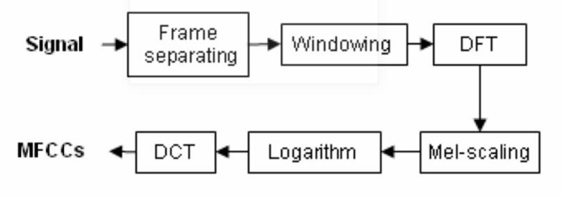

# Music Instrument Classification

In this project we use CNN based models to classify instruments using the Freesound audio data set. Our proposed architecture computes the Mel-spectrogram from the input audio
data and feeds it to a CNN based model. To add robustness to the model, we use a novel data augmentation technique based on the CutMix Algorithm. We optimise the architecture using Hyperparameter Tuning and Pruning, and analyse the model by generating the Class Activation Maps and by conducting an Ablation Study. For detailed information regarding this work, please read our detailed [report](https://emilbiju.github.io/indic-swipe). 

We have taken an open source dataset called ‘Free Sound Audio tagging data’ for classification of musical instruments. The unfiltered version of the dataset had 9400 unique
audio samples stored in .wav format and there were 41 unique classes of instruments

   

This Music instrument classification models can be used in building Content Based Recommender Systems, in Genre Identification tasks and can be extended to provide solutions for
similar problems in other domains, for example in anomaly detection for mechanical systems.
## Key Contributions

1. We make use of CutMix Algorithm on the Mel Spectrograms to augment input data and add robustness to the model.
2. Hyper Parameter Tuning using keras tuner with Random search algorithm.
3. Model Pruning to obtain a lighter model with similar performance metrics as the original model(without pruning).
4. Class Activation Maps to identify neurons that play a significant role in identifying a class.
5. Ablation study to understand the importance of individual layer from the proposed model architecture. 
6. We have also done a thorough comparative analysis of our model with traditionally used instrument classification models.

## People

This work has been developed as a part of a course project  by [Anirudh Sriram](https://github.com/anirudhs123), [Arjun Menon V], [Srinivas Mareddi] and [Nithin Varma] from the Indian Institute of Technology, Madras. Ask us your questions at [anirudhsriram30799@gmail.com](mailto:anirudhsriram30799@gmail.com).
